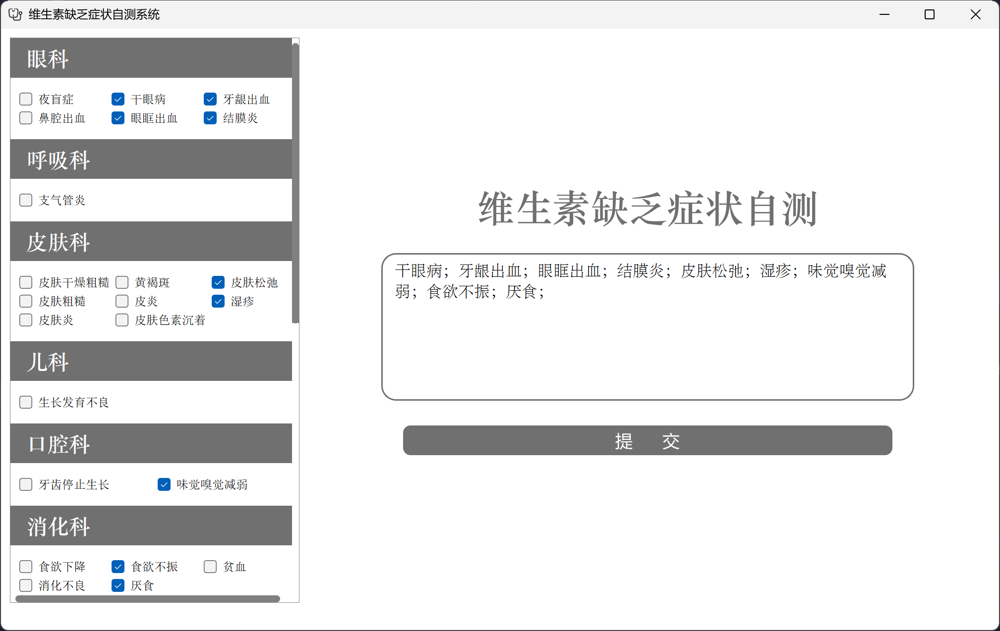
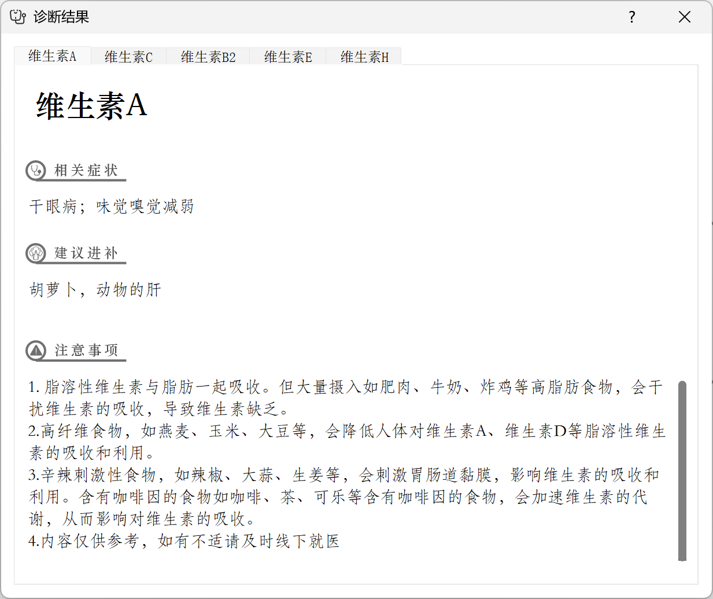

# Vitamin Advisor

[](https://github.com/Jason-Fu-git/VitaminAdvisor/releases/tag/v1.1.0)


## Description

This is a PC application for vitamin recommendation. Basically, the user simply inputs his/her symptoms, then
the program will recommend the most suitable vitamins for him/her.

The user interface is easy to use, displayed as below (prototype):

<div align="center">


Main Window

</div> 
<div align="center">


Dialog
</div> 

## Project Structure

```
VitaminAdvisor
|--- main.py : Program entry
|--- home_ui.py : The codes for the main window
|--- dialog_ui.py : The codes for the dialog box
|--- json : The json files
|    | --- advise.json : Json file organized in the form "vitamin name": "recommendation"
|    | --- symptom_class.json : Json file organized in the form "symptom class": [symptoms]
|    | --- symptom_ls.json : Json file organized in the form [symptoms]
|    | --- symptom_vitamin.json : Json file organized in the form "symptom": "vitamin"
|    | --- vitamin_symptom.json : Json file organized in the form "vitamin": [symptoms]
|    | --- warning.json : Json file organized in the form "vitamin": "warning"
|--- icons : The icons
|--- styles : The qss files
```

Note that if you want to modify the display, you can simply modify the corresponding `.json` files.

## Acknowledgement

- Programmed by Jason Fu and Zhang Zhengyu.
- Data provided by Li Chaoran.
- UI based on Qt.
- Icon downloaded from www.iconfont.cn.

Note : This program is only for school assignment. Commercial use is neither allowed nor practical.